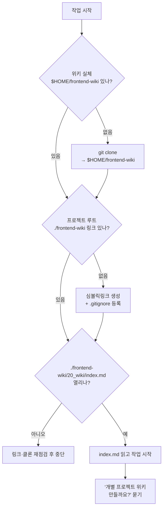

# 에이전트 지침 파일 작성 가이드

각 프로젝트의 **에이전트 지침 파일**(`AGENTS.md`·`CLAUDE.md`)을 작성·수정하고, 공통 위키를 연동하는 방법.

## 실행 흐름



## 지침 파일은 2개뿐

프로젝트 지침은 **`AGENTS.md`와 `CLAUDE.md` 두 파일만** 둔다.

| 파일          | 역할                                  | git |
| ----------- | ----------------------------------- | --- |
| `AGENTS.md` | 지침의 단일 기준(SSOT). 모든 규칙·절차는 여기에만.    | 커밋  |
| `CLAUDE.md` | `AGENTS.md`를 따르라는 짧은 포인터. 내용 중복 금지. | 커밋  |

- 같은 내용을 두 곳에 쓰면 어긋나 지침이 표류한다. `CLAUDE.md`는 요약조차 두지 않고 `AGENTS.md`를 가리키기만 한다.
- **이미 있는 파일은 덮어쓰지 않는다.** 필요한 내용만 추가 기재하고, 추가분을 **반드시 사용자에게 알린다.**

`CLAUDE.md`를 생성할 때는 아래 **한 줄만** 넣는다. Claude Code가 `@경로` import로 `AGENTS.md`를 그대로 로드하므로 다른 문장은 두지 않는다.

```md
@AGENTS.md
```

## `AGENTS.md`에 넣을 내용

**정말 간단하게** 쓴다. 핵심은 공통 위키를 가리키는 것과 git 규칙뿐이다. 상세 연동 절차는 아래 "위키 연동"을 가리키기만 하고 복붙하지 않는다.

```md
# AGENTS.md

이 프로젝트의 모든 에이전트는 공통 위키를 참조해 작업한다.

- 연동돼 있으면 `./frontend-wiki/20_wiki/index.md`를 직접 열어 읽는다.
- 아직 연동 안 됐으면 위키 `20_wiki/operations/agent-instruction-guide.md`의
  "위키 연동" 절차를 따라 연동한 뒤 진행한다.
- index를 읽은 뒤 `./frontend-wiki/20_wiki/conventions/`·`./frontend-wiki/20_wiki/operations/`
  문서를 **선행 학습한다(필수).**

## git 규칙 (필수)

보호 브랜치(`main`·`dev`·`prod`)에 직접 커밋·push 금지(예외 없음). "커밋/푸시 해줘"만 말해도 묻지 말고 작업 브랜치부터 만든다.
브랜치 전략은 `./frontend-wiki/20_wiki/operations/branch-strategy.md`를 따른다 —
인프라·위키 저장소는 main 단일 트랙, 사내 제품 프로젝트는 prod/dev 트랙.
커밋 전 `git branch --show-current`로 확인하고, 보호 브랜치면 트랙에 맞는
작업 브랜치를 만들어 이동한 뒤 진행한다. 반영은 작업 브랜치 → PR/MR.

## 작업 기록 (필수)

작업이 끝나면 `./frontend-wiki/20_wiki/operations/project-wiki-guide.md`를 따라
작업 내용을 `docs/worklog.md`에 기재한다.

## MR / PR (필수)

사용자가 MR/PR 작성을 요청하면 `./frontend-wiki/20_wiki/operations/mr-pr-guide.md`를
반드시 먼저 읽고 숙지한 뒤 절차대로 작성한다.

## 도구 활용

- 라이브러리·프레임워크 문서 검색은 **context7**(MCP)을 우선 활용한다.
  사용법·설치는 `./frontend-wiki/20_wiki/operations/context7-instruction-guide.md`를 따른다.
- 개발은 **superpowers** 프로세스 스킬 사용을 권장한다. 설치되어 있지 않으면
  `./frontend-wiki/20_wiki/operations/superpowers-instruction-guide.md`의 설치 절차를 참고한다.
```

> **git 규칙은 예외가 없다.** 변경량이 작거나 "빨리"·"바로" 요청이어도 `main` 직접 커밋·push 안 한다. 이미 기본 브랜치에 커밋했으면 push 전에 중단하고 사용자에게 알린다. 프로젝트 자체 커밋 컨벤션이 있으면 그 문서를 가리키되 이 절대 규칙은 빠뜨리지 않는다.

## 위키 연동

위키 실체는 **`$HOME/frontend-wiki` 한 곳**에만 둔다. 프로젝트마다 복제하지 않는다. 프로젝트 루트에는 그곳을 가리키는 심볼릭링크 **`./frontend-wiki`**만 만들고, 항상 상대경로 `./frontend-wiki/...`로 읽는다. (`$HOME`·`~`·절대경로를 읽기 도구에 넘기지 않는다 — 링크가 머신 차이를 흡수한다.)

- repo: `https://gitlab.infra.cnai.ai/platform/agent/frontend-wiki.git`
- 읽기 진입점: `./frontend-wiki/20_wiki/index.md`

위 다이어그램 순서대로 현재 상태를 판별해 처리한다.

**① 위키가 아예 없음** — clone부터.

```bash
git clone https://gitlab.infra.cnai.ai/platform/agent/frontend-wiki.git "$HOME/frontend-wiki"
```

**② 위키는 있는데 링크 미설정** — 프로젝트 루트에서 링크 생성.

```bash
# macOS / Linux / WSL
ln -sf "$HOME/frontend-wiki" ./frontend-wiki
```
```powershell
# Windows PowerShell (관리자)
New-Item -Force -ItemType SymbolicLink -Path .\frontend-wiki -Target "$HOME\frontend-wiki"
```

- 프로젝트 `.gitignore`에 아래를 등록한다. `frontend-wiki` 링크는 머신마다 재생성되고, superpowers 산출물은 git에 올리지 않는다([[superpowers-instruction-guide]]).

  ```gitignore
  frontend-wiki
  docs/superpowers/
  .superpowers/
  ```
- `./frontend-wiki/20_wiki/index.md`가 실제로 열리는지 검증한다(링크 존재만으로 갈음 금지).

**③ 연동 완료** — `index.md`가 바로 열리면 superpowers 설치를 확인하고(`claude plugin list | grep -i superpowers`, 미설치면 [[superpowers-instruction-guide]] 설치 절차, 이미 있으면 그대로) 그 문서를 읽고 작업을 시작한다. (필요 시 `git -C "$HOME/frontend-wiki" pull --ff-only`로 최신화.) 이어서 사용자에게 **"개별 프로젝트 위키도 지금 만들까요?"**라고 물어본다([[project-wiki-guide]]).

clone·링크·검증 중 하나라도 실패하면 사실을 말하고 중단한다.
