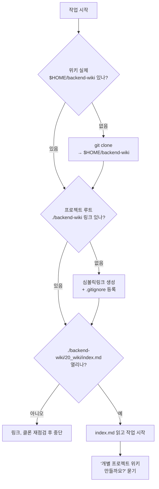

# 에이전트 지침 파일 작성 가이드

각 프로젝트의 **에이전트 지침 파일**(`AGENTS.md`, `CLAUDE.md`)을 작성, 수정하고, 공통 위키를 연동하는 방법. 목차: [목차](../index.md)

## 실행 흐름



## 지침 파일은 2개뿐

프로젝트 지침은 **`AGENTS.md`와 `CLAUDE.md` 두 파일만** 둔다. 로컬 전용 개인 파일(`AGENTS.override.md`, `CLAUDE.local.md` 등)은 만들지 않는다.

| 파일 | 역할 | git |
|---|---|---|
| `AGENTS.md` | 지침의 단일 기준(SSOT). 모든 규칙, 절차는 여기에만. | 커밋 |
| `CLAUDE.md` | `AGENTS.md`를 따르라는 짧은 포인터. 내용 중복 금지. | 커밋 |

- 같은 내용을 두 곳에 쓰면 어긋나 지침이 표류한다. `CLAUDE.md`는 요약조차 두지 않고 `AGENTS.md`를 가리키기만 한다.
- **이미 있는 파일은 덮어쓰지 않는다.** 필요한 내용만 추가 기재하고, 추가분을 **반드시 사용자에게 알린다.**

`CLAUDE.md` 예시:

```md
# CLAUDE.md

이 프로젝트의 모든 에이전트 지침은 `AGENTS.md`를 단일 기준(SSOT)으로 따른다.
작업 시작 전 반드시 `AGENTS.md`를 먼저 읽고 그대로 따른다.

규칙을 여기에 요약, 중복하지 않는다. 항상 `AGENTS.md`에서 직접 확인한다.
```

## `AGENTS.md`에 넣을 내용

**정말 간단하게** 쓴다. 핵심은 공통 위키를 가리키는 것과 git 규칙뿐이다. 상세 연동 절차는 아래 "위키 연동"을 가리키기만 하고 복붙하지 않는다.

```md
# AGENTS.md

이 프로젝트의 모든 에이전트는 공통 위키를 참조해 작업한다.

- 연동돼 있으면 [목차](./backend-wiki/20_wiki/index.md)를 직접 열어 읽는다.
- 아직 연동 안 됐으면 위키 [에이전트 지침 파일 작성 가이드](./backend-wiki/20_wiki/operations/agent-instruction-guide.md)의
  "위키 연동" 절차를 따라 연동한 뒤 진행한다.

## git 규칙 (필수)

`main`에 직접 커밋, push 금지(예외 없음). "커밋/푸시 해줘"만 말해도 묻지 말고 작업 브랜치부터 만든다.
커밋 전 `git branch --show-current`로 확인하고, `main`이면 작업 브랜치(`feat/...`, `fix/...`, `docs/...`)를 만들어 이동한 뒤 진행한다. 반영은 작업 브랜치 → PR/MR.
```

> **git 규칙은 예외가 없다.** 변경량이 작거나 "빨리", "바로" 요청이어도 `main` 직접 커밋, push 안 한다. 이미 기본 브랜치에 커밋했으면 push 전에 중단하고 사용자에게 알린다. 프로젝트 자체 커밋 컨벤션이 있으면 그 문서를 가리키되 이 절대 규칙은 빠뜨리지 않는다.

## 위키 연동

위키 실체는 **`$HOME/backend-wiki` 한 곳**에만 둔다. 프로젝트마다 복제하지 않는다. 프로젝트 루트에는 그곳을 가리키는 심볼릭링크 **`./backend-wiki`**만 만들고, 항상 상대경로 `./backend-wiki/...`로 읽는다. (`$HOME`, `~`, 절대경로를 읽기 도구에 넘기지 않는다 — 링크가 머신차를 흡수한다.)

- repo: `https://gitlab.infra.cnai.ai/platform/agent/backend-wiki.git`
- 읽기 진입점: [목차](./backend-wiki/20_wiki/index.md)

위 다이어그램 순서대로 현재 상태를 판별해 처리한다.

**① 위키가 아예 없음** — clone부터.

```bash
git clone https://gitlab.infra.cnai.ai/platform/agent/backend-wiki.git "$HOME/backend-wiki"
```

**② 위키는 있는데 링크 미설정** — 프로젝트 루트에서 링크 생성.

```bash
# macOS / Linux / WSL
ln -sf "$HOME/backend-wiki" ./backend-wiki
```
```powershell
# Windows PowerShell (관리자)
New-Item -Force -ItemType SymbolicLink -Path .\backend-wiki -Target "$HOME\backend-wiki"
```

- 프로젝트 `.gitignore`에 `backend-wiki`를 등록한다(링크는 절대 커밋하지 않는다 — 머신마다 재생성).
- [목차](./backend-wiki/20_wiki/index.md)가 실제로 열리는지 검증한다(링크 존재만으로 갈음 금지).

**③ 연동 완료** — `index.md`가 바로 열리면 그 문서를 읽고 작업을 시작한다. (필요 시 `git -C "$HOME/backend-wiki" pull --ff-only`로 최신화.) 이어서 사용자에게 **"개별 프로젝트 위키도 지금 만들까요?"**라고 물어본다([개별 프로젝트 위키 생성 및 작성 가이드](project-wiki-guide.md)).

clone, 링크, 검증 중 하나라도 실패하면(네트워크, 권한) 사실을 말하고 중단한다.
