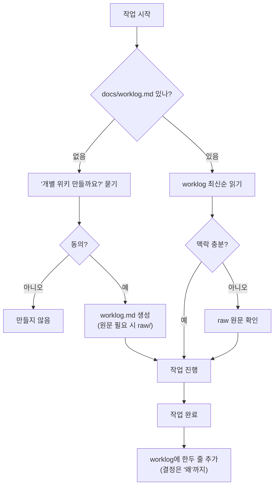

# 개별 프로젝트 위키 생성 및 작성 가이드

다른 프로젝트에서 에이전트에게 **맥락 파악용** 위키를 만들게 할 때 따르는 규칙.

> frontend-wiki 내부 규칙이 아니라, **소비 프로젝트**에 적용하는 규칙이다.
> 전체 문서화가 아니라 **코드만 봐서는 모르는 맥락**만 남긴다. 목적은 새 세션의 에이전트가 프로젝트를 빠르게 따라잡는 것.

## 실행 흐름



**핵심 규칙**

- **작업이 끝나면 worklog에 기재한다.** 읽기는 맥락 파악을 위해 자유롭게.
- **파일 자동 생성 금지.** 위키가 없으면 말없이 넘기지 말고 "만들까요?"라고 **반드시 묻는다.** 공통 위키 연동 직후([[agent-instruction-guide]] 부트스트랩 경우 3)에도 이어서 물어본다.
- 사용자가 거절하면 아무것도 만들거나 고치지 않는다. 거절한 프로젝트에서는 worklog 기재도 하지 않는다.

## 구조 — raw와 worklog 둘뿐

```
docs/
├── raw/             # (선택) 원문 보관소 — 회의록·메모, 평면 구조
│   └── 2026-06-24-결제-정책-회의.md
└── worklog.md       # (필수) 누적 작업 로그
```

## worklog.md (필수)

무엇을 했고 **왜 그랬는지**를 시간순으로 누적한다. 프로젝트 위키의 본체다.

- **작업 완료 시 기재** — 작업이 끝나면 그 작업 내용을 추가한다. 작업 중간의 임시 기록은 하지 않는다.
- 작성·압축 형식은 [[log-writing-guide]]를 따른다. frontend-wiki의 [20_wiki/log.md](/20_wiki/log.md)와 같은 규칙.

## raw/ (선택)

회의록·메모·긴 대화 로그처럼 나중에 다시 검증할 원문만 보관한다.

- 수정하지 않는다. 거칠어도 원문성 유지.
- **평면 구조**, 파일명 `YYYY-MM-DD-주제.md`.
- 보안 정보·토큰·개인정보 금지. 필요하면 마스킹.

## 관련
[[commit-convention]] · [[mr-pr-guide]]
